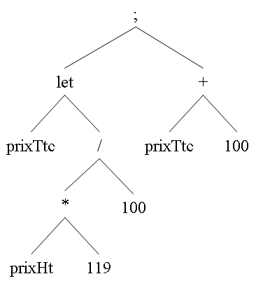

# TP2/3/4 INFO 805 COMPILATION

L'objectif du TP est d'utiliser les outils JFlex et CUP pour générer des arbres abstraits correspondant à un sous ensemble du langage **λ-ada**.

## Membres du groupe

- BAZIN Morgan

## Comment run notre code ?

Dans notre repository nous avons deux fichiers textes, ayant les noms suivants :

- testEx1.txt
- testEx2.txt

Les fichiers textes correspondent aux exercices pour générer le code.

### Avant de commencer, veuillez générer le .jar :

```bash
./gradlew clean
```

et

```bash
./gradlew build
```

Pour tester l'exercice 1, veuillez lancer cette commande :

```bash
java -jar build/libs/TP2_INFO805-main.jar testEx1.txt > test1.asm
```

Le résultat de l'exercice est stocké dans le fichier test1.asm.

Pour tester l'exercice 2, veuillez lancer cette commande :

```bash
java -jar build/libs/TP2_INFO805-main.jar testEx2.txt > test2.asm
```

Le résultat de l'exercice est stocké dans le fichier test2.asm.

## Exercice 1 :

Utiliser JFlex et CUP pour générer l'arbre abstrait correspondant à l'analyse d'expressions arithmétiques sur les nombres entiers.

Exemple de fichier source pour l'analyseur :

```
12 + 5;             /* ceci est un commentaire */
10 / 2 - 3;  99;    /* le point-virgule sépare les expressions à évaluer */
/* l'évaluation donne toujours un nombre entier */
((30 * 1) + 4) mod 2; /* opérateurs binaires */
3 * -4;             /* attention à l'opérateur unaire */

let prixHt = 200;   /* une variable prend valeur lors de sa déclaration */
let prixTtc =  prixHt * 119 / 100;
prixTtc + 100.
```

L'expression

```
let prixTtc =  prixHt * 119 / 100;
prixTtc + 100
```

pourra donner, par exemple, l'arbre suivant :



Une fois l'arbre généré, récupérez le dans le programme pricipal et affichez le, par exemple sous la forme d'une expression préfixée parenthésée :
`(; (LET prixTtc (/ (* prixHt 119) 100)) (+ prixTtc 100))`

## Exercice 2 :

Compléter la grammaire précédente en y ajoutant les opérateurs booléens, ceux de comparaison, la boucle et la conditionnelle, afin d'obtenir un sous-ensemble du langage **λ-ada** un peu plus complet.

Grammaire abstraite du sous-ensemble de λ-ada correspondant :

```
expression → expression ';' expression
expression → LET IDENT '=' expression
expression → IF expression THEN expression ELSE expression
expression → WHILE expression DO expression
expression → '-' expression
expression → expression '+' expression
expression → expression '-' expression
expression → expression '*' expression
expression → expression '/' expression
expression → expression MOD expression
expression → expression '<' expression
expression → expression '<=' expression
expression → expression '=' expression
expression → expression AND expression
expression → expression OR expression
expression → NOT expression
expression → OUTPUT expression
expression → INPUT | NIL | IDENT | ENTIER
```

Le langage obtenu est tout de suite un peu plus intéressant et permet de programmer plus de choses.

Exemple de programme possible pour le sous-ensemble de λ-ada considéré ici : calcul de PGCD.

```
let a = input;
let b = input;
while (0 < b)
do (let aux=(a mod b); let a=b; let b=aux );
output a .
```

# SUITE

À partir de l'arbre abstrait construit lors du dernier TP, avec les outils JFlex et CUP, l'objectif consiste à générer du code pour la machine à registres décrite dans le cours, afin d'être en mesure d'exécuter les programmes reconnus par l'analyseur sur la machine à registres.

## Exercice 1 :

Dans la première partie du tp on pourra se limiter à la génération de code pour les expressions arithmétiques sur les nombres entiers.

Ainsi, l'expression

```
let prixHt = 200;
let prixTtc =  prixHt * 119 / 100 .
```

correspondant, par exemple, à l'arbre ci-dessous pourrait amener à la production du code suivant :

```
DATA SEGMENT
	prixHt DD
	prixTtc DD
DATA ENDS
CODE SEGMENT
	mov eax, 200
	mov prixHt, eax
	mov eax, prixHt
	push eax
	mov eax, 119
	pop ebx
	mul eax, ebx
	push eax
	mov eax, 100
	pop ebx
	div ebx, eax
	mov eax, ebx
	mov prixTtc, eax
CODE ENDS
```

```
; ──┬── LET ──┬── prixHt
    │         │
    │         └── 200
    │
    └── LET ──┬── prixTtc
              │
              └── / ──┬── * ──┬── prixHt
                      │       │
                      │       └── 119
                      │
                      └── 100
```

## Exercice 2 :

Étendre la génération de code aux opérateurs booléens, de comparaison, aux boucles et aux conditionnelles, correspondant au sous-ensemble du langage **λ-ada** utilisé pour le TP précédent.

Exemple de code source pour le compilateur : calcul de PGCD.

```
let a = input;
let b = input;
while (0 < b)
do (let aux=(a mod b); let a=b; let b=aux );
output a
.
```

Et un exemple de code qui pourrait être produit :

```
DATA SEGMENT
	b DD
	a DD
	aux DD
DATA ENDS
CODE SEGMENT
	in eax
	mov a, eax
	in eax
	mov b, eax
debut_while_1:
	mov eax, 0
	push eax
	mov eax, b
	pop ebx
	sub eax,ebx
	jle faux_gt_1
	mov eax,1
	jmp sortie_gt_1
faux_gt_1:
	mov eax,0
sortie_gt_1:
	jz sortie_while_1
	mov eax, b
	push eax
	mov eax, a
	pop ebx
	mov ecx,eax
	div ecx,ebx
	mul ecx,ebx
	sub eax,ecx
	mov aux, eax
	mov eax, b
	mov a, eax
	mov eax, aux
	mov b, eax
	jmp debut_while_1
sortie_while_1:
	mov eax, a
	out eax
CODE ENDS
```
